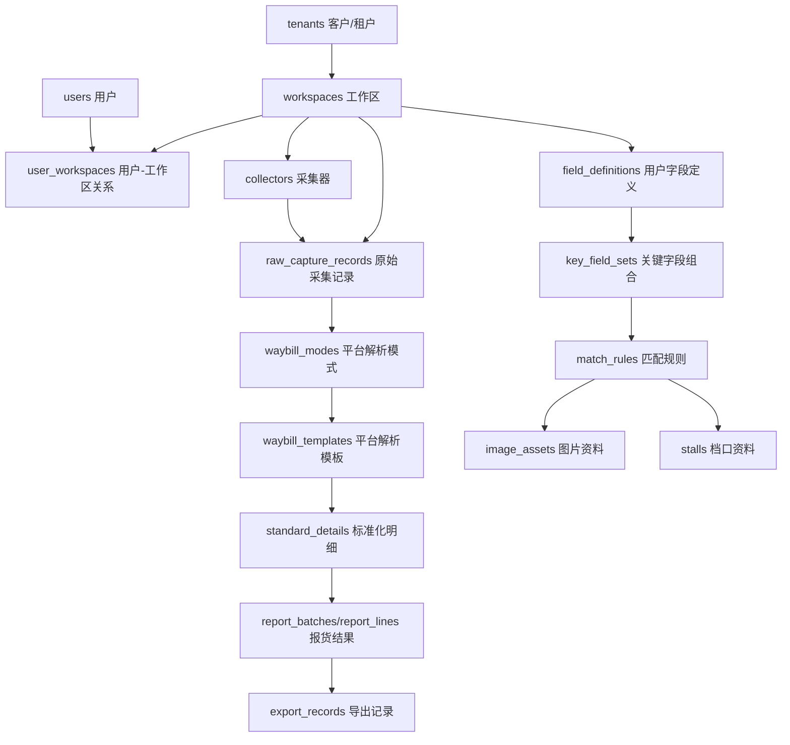

# 数据库与租户归属设计

> 日期：2026-06-11  
> 当前版本：第一版平台数据库方案  
> 适用范围：服务端后台、客户业务页面、客户管理页面、采集器接入

## 1. 总目标

本项目不是固定行业订单系统，也不是预设商品、店铺、规格、鞋款等业务对象的系统。

平台要做的是：

```text
读取面单 / 打印组件 / 上传文件
  -> 保留原始采集内容
  -> 识别面单模式
  -> 使用平台共用解析规则把杂乱 JSON / 文本整理成客户可读的面单信息
  -> 让客户在自己的工作区定义如何使用这些面单信息做关键字段、图片、档口、商品匹配和导出
  -> 按客户配置生成报货 Excel
```

所以数据库只能保存平台能力、租户归属、面单原始数据、标准化明细和用户配置，不能在平台层写死某个业务领域的概念。

## 2. 第一版数据库策略

第一版采用单个平台数据库，多租户逻辑隔离。

```text
一个平台数据库
  -> 多个 tenant 客户/租户
  -> 每个 tenant 下可有多个 workspace 工作区
  -> 所有客户业务数据同时保存 tenant_id 和 workspace_id
```

选择这个方案的原因：

```text
1. 第一版开发、部署、备份和升级复杂度最低。
2. 可以先把平台框架、登录、工作区隔离、字段配置、采集器接入跑通。
3. tenant_id 方便按客户查询、迁移、审计和未来拆库。
4. workspace_id 继续作为当前用户可访问数据的强过滤字段。
```

后续如果某个客户数据量或隔离要求升高，可以在保持同一套业务模型的前提下，演进为独立数据库或分库分表。

## 3. 页面与数据库边界

服务端后台管理页面只维护平台控制信息，不维护客户业务数据。

```text
平台私有后台，独立端口：
  /admin
  维护 tenants、workspaces、users、平台共用面单解析模式和解析模板

客户业务页面，客户可见端口：
  /
  员工采集、上传、查看记录、处理异常、导出

客户管理页面，客户可见端口：
  /admin
  客户管理员维护采集连接、字段、关键字段、图片、档口、匹配和导出配置
```

客户可见 URL 不出现 client/server 字样。代码内部文件名可以保留工程命名，但不能成为客户页面、菜单或部署地址的表达。

## 4. 表域划分

### 4.1 平台控制域

这些表用于平台账户、客户映射和基础权限：

```text
tenants
workspaces
users
roles
user_workspaces
```

说明：

```text
tenants：客户/租户。
workspaces：客户下的工作区。
users：平台登录用户。
roles：工作区内角色，当前已带 tenant_id + workspace_id。
user_workspaces：用户与工作区关系，当前已带 tenant_id + workspace_id。
```

### 4.2 平台面单解析域

这些表描述平台当前支持的面单读取方式、打印组件数据结构和解析模板。它们属于全平台共用逻辑，不属于某一个客户 workspace。

```text
waybill_modes
waybill_templates
waybill_template_fields
```

平台解析域负责把采集器上传的杂乱 JSON、XML、文本或混合 payload 转成客户能看懂的面单信息。客户不能直接维护这些底层解析规则，客户维护的是整理后的面单信息如何参与商品、图片、档口、汇总和导出匹配。

2026-06-11 已修正：`waybill_modes`、`waybill_templates`、`waybill_template_fields` 已从 workspace-scoped 拆出，作为平台全局解析规则。

### 4.3 采集域

这些表保存客户业务机、打印组件和原始数据回传：

```text
collectors
capture_tasks
capture_batches
raw_capture_records
```

采集器通常分布在客户多台业务机上，优先适配菜鸟打印组件和抖店打印组件。采集器只上传原始内容和来源信息，不定义业务字段含义。

### 4.4 标准化明细域

这些表保存平台解析后的客户可读面单信息：

```text
standard_detail_batches
standard_details
```

`standard_details.field_values` 保存平台解析出的可读字段值集合。字段的业务使用方式、关键字段组合、商品/图片/档口匹配和导出规则来自客户配置，不在平台代码里写死。

### 4.5 客户配置域

这些表由客户管理页面维护：

```text
field_definitions
field_role_configs
key_field_sets
match_rules
```

说明：

```text
field_definitions：客户对平台解析出的面单信息字段定义展示名、用途和导出角色。
key_field_sets：客户选择哪些面单信息字段组成关键字段。
match_rules：关键字段值与图片、档口、导出分组等目标的匹配关系。
field_role_configs：字段在不同用途下的角色和展示配置。
```

### 4.6 图片与档口域

这些表由客户维护，不进入平台服务端后台：

```text
image_assets
stalls
```

图片文件不建议作为 BLOB 存入 MySQL。MySQL 保存元数据、路径、hash、归属和匹配关系，文件保存在 `storage/workspaces/{workspace_id}/...` 或后续对象存储。

### 4.7 报货、异常和导出域

这些表形成后续报货闭环：

```text
report_batches
report_lines
exception_records
export_records
operation_logs
```

报货结果、异常处理、导出记录、操作审计全部属于客户工作区数据。

## 5. 租户字段规则

第一版规则如下：

```text
tenants：平台级表，不带 workspace_id。
workspaces：平台映射表，带 tenant_id，不带 workspace_id。
users：平台账号表，不带 workspace_id。
workspace 业务表：必须同时带 tenant_id 和 workspace_id。
平台共用解析规则表：不应带 tenant_id 和 workspace_id。
```

当前 workspace 业务表包括：

```text
roles
user_workspaces
collectors
capture_tasks
capture_batches
raw_capture_records
standard_detail_batches
standard_details
field_definitions
field_role_configs
key_field_sets
match_rules
stalls
image_assets
report_batches
report_lines
exception_records
export_records
operation_logs
```

写入规则：

```text
1. 前端只选择当前 workspace。
2. 后端根据当前用户可访问 workspace 校验权限。
3. Repository 写入 workspace_id。
4. Repository 根据 workspaces.tenant_id 自动写入 tenant_id。
5. 普通业务表更新时不允许前端修改 tenant_id 和 workspace_id。
```

这可以回答当前关键问题：

```text
账号 A 登录后，如果只绑定 workspace A，它上传和创建的数据会写入 workspace A，并自动带上 workspace A 对应的 tenant_id。
账号 B 不属于 workspace A 时，不能读取、创建、修改账号 A 的 workspace 数据。
```

## 6. 关系草图



## 7. 当前实现状态

已完成：

```text
Tenant ORM 模型
Workspace.tenant_id
WorkspaceModel 统一 tenant_id + workspace_id
UserWorkspace.tenant_id
Repository 创建 workspace 业务数据时自动写入 tenant_id
Repository 更新 workspace 业务数据时锁定 tenant_id 和 workspace_id
Repository 更新 workspaces 时锁定 tenant_id，避免通用 PATCH 造成历史业务数据归属不一致
系统管理员在后端可解析全部 workspace，用于维护客户映射；平台解析规则已脱离 workspace
/auth/me 返回 tenant_ids 和 workspace.tenant_id
SQLite 兼容迁移补齐历史表 tenant_id
启动种子逻辑按 workspace 回填历史业务记录 tenant_id
scripts/init_db.sql 补齐 workspace 业务表 tenant_id 和索引
双用户双 workspace 隔离测试覆盖 tenant_id 差异
waybill_modes、waybill_templates、waybill_template_fields 已改为平台全局解析规则
roles 写操作收紧为平台管理员权限
软删除 role 不再参与当前用户权限计算
```

待继续：

```text
正式引入 Alembic 迁移体系
细化平台管理员、客户管理员、业务人员权限
采集器注册、心跳、离线队列和原始记录回传
标准化 Excel 上传、字段自动读取、报货 Excel 生成闭环
```

## 8. 采集器身份与数据归属补充

采集器不是员工账号，不能用员工用户名和密码登录。采集器应使用设备身份连接服务器。

```text
User：员工账号，用于登录客户业务 UI / 客户管理 UI。
Collector：业务机采集器设备身份，绑定 tenant + workspace。
collector_token：采集器注册后获得的设备凭据。
capture_task / capture_session：一次采集任务，记录由哪个 user 发起和结束。
raw_capture_records：采集器回传的原始记录，由服务器写入 tenant_id + workspace_id。
```

归属规则：

```text
collector 属于 workspace。
capture_task / capture_session 由 user 发起。
raw_capture_records 属于 collector + task/session + workspace。
采集器对应的是客户工作空间，不直接对应某个员工账号。
```

安全要求：

```text
采集器上传数据时，后端必须根据 collector_token 反查 collector_id、tenant_id、workspace_id。
后端不能信任采集器自行传入的 workspace_id。
collector_token 应按安全凭据处理，数据库只保存哈希或等价安全形式。
激活码 / 绑定码应有过期、撤销和使用次数限制。
采集器解绑、停用或重新绑定后，旧 token 必须失效。
```
